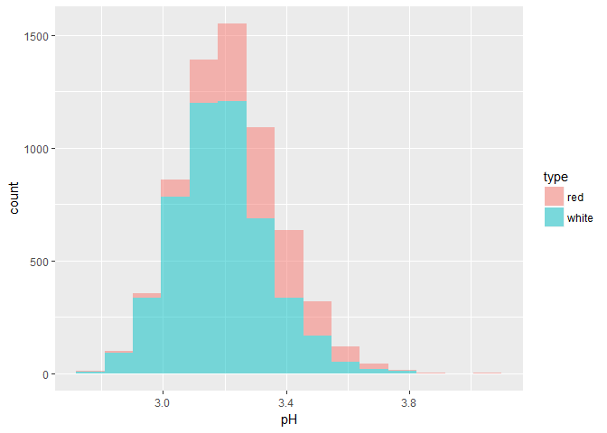

# Wine Quality Analysis (Clustering and Regression)
Andrew Kinsman  
19 May 2016  


## Data Description

See data dictionary at https://archive.ics.uci.edu/ml/machine-learning-databases/wine-quality/winequality.names

* Input variables (based on physicochemical tests):
* 1 - fixed acidity
* 2 - volatile acidity
* 3 - citric acid
* 4 - residual sugar
* 5 - chlorides
* 6 - free sulfur dioxide
* 7 - total sulfur dioxide
* 8 - density
* 9 - pH
* 10 - sulphates
* 11 - alcohol
* Output variable (based on sensory data): 
* 12 - quality (score between 0 and 10)

## Data Preparation


```r
# Read in red data
red <- read.csv("winequality-red.csv", sep = ";")
library(psych)
describe(red)
```

```
##                      vars    n  mean    sd median trimmed   mad  min
## fixed.acidity           1 1599  8.32  1.74   7.90    8.15  1.48 4.60
## volatile.acidity        2 1599  0.53  0.18   0.52    0.52  0.18 0.12
## citric.acid             3 1599  0.27  0.19   0.26    0.26  0.25 0.00
## residual.sugar          4 1599  2.54  1.41   2.20    2.26  0.44 0.90
## chlorides               5 1599  0.09  0.05   0.08    0.08  0.01 0.01
## free.sulfur.dioxide     6 1599 15.87 10.46  14.00   14.58 10.38 1.00
## total.sulfur.dioxide    7 1599 46.47 32.90  38.00   41.84 26.69 6.00
## density                 8 1599  1.00  0.00   1.00    1.00  0.00 0.99
## pH                      9 1599  3.31  0.15   3.31    3.31  0.15 2.74
## sulphates              10 1599  0.66  0.17   0.62    0.64  0.12 0.33
## alcohol                11 1599 10.42  1.07  10.20   10.31  1.04 8.40
## quality                12 1599  5.64  0.81   6.00    5.59  1.48 3.00
##                         max  range skew kurtosis   se
## fixed.acidity         15.90  11.30 0.98     1.12 0.04
## volatile.acidity       1.58   1.46 0.67     1.21 0.00
## citric.acid            1.00   1.00 0.32    -0.79 0.00
## residual.sugar        15.50  14.60 4.53    28.49 0.04
## chlorides              0.61   0.60 5.67    41.53 0.00
## free.sulfur.dioxide   72.00  71.00 1.25     2.01 0.26
## total.sulfur.dioxide 289.00 283.00 1.51     3.79 0.82
## density                1.00   0.01 0.07     0.92 0.00
## pH                     4.01   1.27 0.19     0.80 0.00
## sulphates              2.00   1.67 2.42    11.66 0.00
## alcohol               14.90   6.50 0.86     0.19 0.03
## quality                8.00   5.00 0.22     0.29 0.02
```

```r
# Add type
red$type <- "red"
str(red)
```

```
## 'data.frame':	1599 obs. of  13 variables:
##  $ fixed.acidity       : num  7.4 7.8 7.8 11.2 7.4 7.4 7.9 7.3 7.8 7.5 ...
##  $ volatile.acidity    : num  0.7 0.88 0.76 0.28 0.7 0.66 0.6 0.65 0.58 0.5 ...
##  $ citric.acid         : num  0 0 0.04 0.56 0 0 0.06 0 0.02 0.36 ...
##  $ residual.sugar      : num  1.9 2.6 2.3 1.9 1.9 1.8 1.6 1.2 2 6.1 ...
##  $ chlorides           : num  0.076 0.098 0.092 0.075 0.076 0.075 0.069 0.065 0.073 0.071 ...
##  $ free.sulfur.dioxide : num  11 25 15 17 11 13 15 15 9 17 ...
##  $ total.sulfur.dioxide: num  34 67 54 60 34 40 59 21 18 102 ...
##  $ density             : num  0.998 0.997 0.997 0.998 0.998 ...
##  $ pH                  : num  3.51 3.2 3.26 3.16 3.51 3.51 3.3 3.39 3.36 3.35 ...
##  $ sulphates           : num  0.56 0.68 0.65 0.58 0.56 0.56 0.46 0.47 0.57 0.8 ...
##  $ alcohol             : num  9.4 9.8 9.8 9.8 9.4 9.4 9.4 10 9.5 10.5 ...
##  $ quality             : int  5 5 5 6 5 5 5 7 7 5 ...
##  $ type                : chr  "red" "red" "red" "red" ...
```

```r
# Read in white data
white <- read.csv("winequality-white.csv", sep = ";")
describe(white)
```

```
##                      vars    n   mean    sd median trimmed   mad  min
## fixed.acidity           1 4898   6.85  0.84   6.80    6.82  0.74 3.80
## volatile.acidity        2 4898   0.28  0.10   0.26    0.27  0.09 0.08
## citric.acid             3 4898   0.33  0.12   0.32    0.33  0.09 0.00
## residual.sugar          4 4898   6.39  5.07   5.20    5.80  5.34 0.60
## chlorides               5 4898   0.05  0.02   0.04    0.04  0.01 0.01
## free.sulfur.dioxide     6 4898  35.31 17.01  34.00   34.36 16.31 2.00
## total.sulfur.dioxide    7 4898 138.36 42.50 134.00  136.96 43.00 9.00
## density                 8 4898   0.99  0.00   0.99    0.99  0.00 0.99
## pH                      9 4898   3.19  0.15   3.18    3.18  0.15 2.72
## sulphates              10 4898   0.49  0.11   0.47    0.48  0.10 0.22
## alcohol                11 4898  10.51  1.23  10.40   10.43  1.48 8.00
## quality                12 4898   5.88  0.89   6.00    5.85  1.48 3.00
##                         max  range skew kurtosis   se
## fixed.acidity         14.20  10.40 0.65     2.17 0.01
## volatile.acidity       1.10   1.02 1.58     5.08 0.00
## citric.acid            1.66   1.66 1.28     6.16 0.00
## residual.sugar        65.80  65.20 1.08     3.46 0.07
## chlorides              0.35   0.34 5.02    37.51 0.00
## free.sulfur.dioxide  289.00 287.00 1.41    11.45 0.24
## total.sulfur.dioxide 440.00 431.00 0.39     0.57 0.61
## density                1.04   0.05 0.98     9.78 0.00
## pH                     3.82   1.10 0.46     0.53 0.00
## sulphates              1.08   0.86 0.98     1.59 0.00
## alcohol               14.20   6.20 0.49    -0.70 0.02
## quality                9.00   6.00 0.16     0.21 0.01
```

```r
# Add type
white$type <- "white"
str(white)
```

```
## 'data.frame':	4898 obs. of  13 variables:
##  $ fixed.acidity       : num  7 6.3 8.1 7.2 7.2 8.1 6.2 7 6.3 8.1 ...
##  $ volatile.acidity    : num  0.27 0.3 0.28 0.23 0.23 0.28 0.32 0.27 0.3 0.22 ...
##  $ citric.acid         : num  0.36 0.34 0.4 0.32 0.32 0.4 0.16 0.36 0.34 0.43 ...
##  $ residual.sugar      : num  20.7 1.6 6.9 8.5 8.5 6.9 7 20.7 1.6 1.5 ...
##  $ chlorides           : num  0.045 0.049 0.05 0.058 0.058 0.05 0.045 0.045 0.049 0.044 ...
##  $ free.sulfur.dioxide : num  45 14 30 47 47 30 30 45 14 28 ...
##  $ total.sulfur.dioxide: num  170 132 97 186 186 97 136 170 132 129 ...
##  $ density             : num  1.001 0.994 0.995 0.996 0.996 ...
##  $ pH                  : num  3 3.3 3.26 3.19 3.19 3.26 3.18 3 3.3 3.22 ...
##  $ sulphates           : num  0.45 0.49 0.44 0.4 0.4 0.44 0.47 0.45 0.49 0.45 ...
##  $ alcohol             : num  8.8 9.5 10.1 9.9 9.9 10.1 9.6 8.8 9.5 11 ...
##  $ quality             : int  6 6 6 6 6 6 6 6 6 6 ...
##  $ type                : chr  "white" "white" "white" "white" ...
```

```r
# Combine dataset and examine summary
wine <- rbind(red, white)
wine$type <- as.factor(wine$type)
str(wine)
```

```
## 'data.frame':	6497 obs. of  13 variables:
##  $ fixed.acidity       : num  7.4 7.8 7.8 11.2 7.4 7.4 7.9 7.3 7.8 7.5 ...
##  $ volatile.acidity    : num  0.7 0.88 0.76 0.28 0.7 0.66 0.6 0.65 0.58 0.5 ...
##  $ citric.acid         : num  0 0 0.04 0.56 0 0 0.06 0 0.02 0.36 ...
##  $ residual.sugar      : num  1.9 2.6 2.3 1.9 1.9 1.8 1.6 1.2 2 6.1 ...
##  $ chlorides           : num  0.076 0.098 0.092 0.075 0.076 0.075 0.069 0.065 0.073 0.071 ...
##  $ free.sulfur.dioxide : num  11 25 15 17 11 13 15 15 9 17 ...
##  $ total.sulfur.dioxide: num  34 67 54 60 34 40 59 21 18 102 ...
##  $ density             : num  0.998 0.997 0.997 0.998 0.998 ...
##  $ pH                  : num  3.51 3.2 3.26 3.16 3.51 3.51 3.3 3.39 3.36 3.35 ...
##  $ sulphates           : num  0.56 0.68 0.65 0.58 0.56 0.56 0.46 0.47 0.57 0.8 ...
##  $ alcohol             : num  9.4 9.8 9.8 9.8 9.4 9.4 9.4 10 9.5 10.5 ...
##  $ quality             : int  5 5 5 6 5 5 5 7 7 5 ...
##  $ type                : Factor w/ 2 levels "red","white": 1 1 1 1 1 1 1 1 1 1 ...
```

```r
summary(wine)
```

```
##  fixed.acidity    volatile.acidity  citric.acid     residual.sugar  
##  Min.   : 3.800   Min.   :0.0800   Min.   :0.0000   Min.   : 0.600  
##  1st Qu.: 6.400   1st Qu.:0.2300   1st Qu.:0.2500   1st Qu.: 1.800  
##  Median : 7.000   Median :0.2900   Median :0.3100   Median : 3.000  
##  Mean   : 7.215   Mean   :0.3397   Mean   :0.3186   Mean   : 5.443  
##  3rd Qu.: 7.700   3rd Qu.:0.4000   3rd Qu.:0.3900   3rd Qu.: 8.100  
##  Max.   :15.900   Max.   :1.5800   Max.   :1.6600   Max.   :65.800  
##    chlorides       free.sulfur.dioxide total.sulfur.dioxide
##  Min.   :0.00900   Min.   :  1.00      Min.   :  6.0       
##  1st Qu.:0.03800   1st Qu.: 17.00      1st Qu.: 77.0       
##  Median :0.04700   Median : 29.00      Median :118.0       
##  Mean   :0.05603   Mean   : 30.53      Mean   :115.7       
##  3rd Qu.:0.06500   3rd Qu.: 41.00      3rd Qu.:156.0       
##  Max.   :0.61100   Max.   :289.00      Max.   :440.0       
##     density             pH          sulphates         alcohol     
##  Min.   :0.9871   Min.   :2.720   Min.   :0.2200   Min.   : 8.00  
##  1st Qu.:0.9923   1st Qu.:3.110   1st Qu.:0.4300   1st Qu.: 9.50  
##  Median :0.9949   Median :3.210   Median :0.5100   Median :10.30  
##  Mean   :0.9947   Mean   :3.219   Mean   :0.5313   Mean   :10.49  
##  3rd Qu.:0.9970   3rd Qu.:3.320   3rd Qu.:0.6000   3rd Qu.:11.30  
##  Max.   :1.0390   Max.   :4.010   Max.   :2.0000   Max.   :14.90  
##     quality         type     
##  Min.   :3.000   red  :1599  
##  1st Qu.:5.000   white:4898  
##  Median :6.000               
##  Mean   :5.818               
##  3rd Qu.:6.000               
##  Max.   :9.000
```

## Exploratory Data analysis


```r
# Examine quality variable
table(wine$quality)
```

```
## 
##    3    4    5    6    7    8    9 
##   30  216 2138 2836 1079  193    5
```

```r
t.test(wine$quality[wine$type == "red"], wine$quality[wine$type == "white"])
```

```
## 
## 	Welch Two Sample t-test
## 
## data:  wine$quality[wine$type == "red"] and wine$quality[wine$type == "white"]
## t = -10.149, df = 2950.8, p-value < 2.2e-16
## alternative hypothesis: true difference in means is not equal to 0
## 95 percent confidence interval:
##  -0.2886173 -0.1951564
## sample estimates:
## mean of x mean of y 
##  5.636023  5.877909
```

```r
# Examine the best wines
which(wine$quality == 9)
```

```
## [1] 2374 2420 2427 2476 3205
```

```r
best <- wine[c(2374, 2420, 2427, 2476, 3205), ]
best
```

```
##      fixed.acidity volatile.acidity citric.acid residual.sugar chlorides
## 2374           9.1             0.27        0.45           10.6     0.035
## 2420           6.6             0.36        0.29            1.6     0.021
## 2427           7.4             0.24        0.36            2.0     0.031
## 2476           6.9             0.36        0.34            4.2     0.018
## 3205           7.1             0.26        0.49            2.2     0.032
##      free.sulfur.dioxide total.sulfur.dioxide density   pH sulphates
## 2374                  28                  124 0.99700 3.20      0.46
## 2420                  24                   85 0.98965 3.41      0.61
## 2427                  27                  139 0.99055 3.28      0.48
## 2476                  57                  119 0.98980 3.28      0.36
## 3205                  31                  113 0.99030 3.37      0.42
##      alcohol quality  type
## 2374    10.4       9 white
## 2420    12.4       9 white
## 2427    12.5       9 white
## 2476    12.7       9 white
## 3205    12.9       9 white
```

```r
t.test(wine$quality[wine$chlorides <= 0.35], wine$quality[wine$chlorides > 
    0.35], alternative = "greater")
```

```
## 
## 	Welch Two Sample t-test
## 
## data:  wine$quality[wine$chlorides <= 0.35] and wine$quality[wine$chlorides > 0.35]
## t = 3.9116, df = 17.173, p-value = 0.0005522
## alternative hypothesis: true difference in means is greater than 0
## 95 percent confidence interval:
##  0.3321035       Inf
## sample estimates:
## mean of x mean of y 
##  5.820034  5.222222
```

```r
library(ggplot2)
```

```
## 
## Attaching package: 'ggplot2'
```

```
## The following objects are masked from 'package:psych':
## 
##     %+%, alpha
```

```r
ggplot(wine, aes(x = type, y = quality)) + ggtitle("Boxplot of Wine Quality vs. Type") + 
    geom_boxplot() + geom_point(position = "jitter", color = "blue", alpha = 0.05)  # FIG.1
```

<!-- -->

```r
# Explore residual sugar of reds vs. whites
ggplot(wine, aes(x = residual.sugar, fill = type)) + ggtitle("Histogram of Residual Sugar by Type") + 
    geom_histogram(alpha = 0.5, bins = 15)  # FIG.2
```

<!-- -->

```r
table(wine$residual.sugar > 9, wine$type)
```

```
##        
##          red white
##   FALSE 1588  3531
##   TRUE    11  1367
```

```r
# Various histograms for EDA purposes
ggplot(wine, aes(x = fixed.acidity, fill = type)) + geom_histogram(alpha = 0.5, 
    bins = 15)
```

<!-- -->

```r
ggplot(wine, aes(x = volatile.acidity, fill = type)) + geom_histogram(alpha = 0.5, 
    bins = 15)
```

<!-- -->

```r
ggplot(wine, aes(x = citric.acid, fill = type)) + geom_histogram(alpha = 0.5, 
    bins = 15)
```

<!-- -->

```r
ggplot(wine, aes(x = chlorides, fill = type)) + geom_histogram(alpha = 0.5, 
    bins = 15)
```

<!-- -->

```r
ggplot(wine, aes(x = free.sulfur.dioxide, fill = type)) + geom_histogram(alpha = 0.5, 
    bins = 15)
```

<!-- -->

```r
ggplot(wine, aes(x = total.sulfur.dioxide, fill = type)) + geom_histogram(alpha = 0.5, 
    bins = 15)  # marked difference between red and white
```

<!-- -->

```r
ggplot(wine, aes(x = density, fill = type)) + geom_histogram(alpha = 0.5, 
    bins = 15)
```

<!-- -->

```r
ggplot(wine, aes(x = pH, fill = type)) + geom_histogram(alpha = 0.5, bins = 15)
```

<!-- -->

```r
ggplot(wine, aes(x = sulphates, fill = type)) + geom_histogram(alpha = 0.5, 
    bins = 15)
```

<!-- -->

```r
ggplot(wine, aes(x = alcohol, fill = type)) + geom_histogram(alpha = 0.5, 
    bins = 15)  # v.minimal difference between red and white
```

<!-- -->

```r
# load the libraries
library(mlbench)
library(corrplot)
library(caret)
```

```
## Loading required package: lattice
```

```r
# Remove dependent variable (quality) and scale red data for
# correlation matrix
red.scaled <- scale(red[, 1:11])
# calculate correlation matrix
correlationMatrixR <- cor(red.scaled)
correlationMatrixR
```

```
##                      fixed.acidity volatile.acidity citric.acid
## fixed.acidity           1.00000000     -0.256130895  0.67170343
## volatile.acidity       -0.25613089      1.000000000 -0.55249568
## citric.acid             0.67170343     -0.552495685  1.00000000
## residual.sugar          0.11477672      0.001917882  0.14357716
## chlorides               0.09370519      0.061297772  0.20382291
## free.sulfur.dioxide    -0.15379419     -0.010503827 -0.06097813
## total.sulfur.dioxide   -0.11318144      0.076470005  0.03553302
## density                 0.66804729      0.022026232  0.36494718
## pH                     -0.68297819      0.234937294 -0.54190414
## sulphates               0.18300566     -0.260986685  0.31277004
## alcohol                -0.06166827     -0.202288027  0.10990325
##                      residual.sugar    chlorides free.sulfur.dioxide
## fixed.acidity           0.114776724  0.093705186        -0.153794193
## volatile.acidity        0.001917882  0.061297772        -0.010503827
## citric.acid             0.143577162  0.203822914        -0.060978129
## residual.sugar          1.000000000  0.055609535         0.187048995
## chlorides               0.055609535  1.000000000         0.005562147
## free.sulfur.dioxide     0.187048995  0.005562147         1.000000000
## total.sulfur.dioxide    0.203027882  0.047400468         0.667666450
## density                 0.355283371  0.200632327        -0.021945831
## pH                     -0.085652422 -0.265026131         0.070377499
## sulphates               0.005527121  0.371260481         0.051657572
## alcohol                 0.042075437 -0.221140545        -0.069408354
##                      total.sulfur.dioxide     density          pH
## fixed.acidity                 -0.11318144  0.66804729 -0.68297819
## volatile.acidity               0.07647000  0.02202623  0.23493729
## citric.acid                    0.03553302  0.36494718 -0.54190414
## residual.sugar                 0.20302788  0.35528337 -0.08565242
## chlorides                      0.04740047  0.20063233 -0.26502613
## free.sulfur.dioxide            0.66766645 -0.02194583  0.07037750
## total.sulfur.dioxide           1.00000000  0.07126948 -0.06649456
## density                        0.07126948  1.00000000 -0.34169933
## pH                            -0.06649456 -0.34169933  1.00000000
## sulphates                      0.04294684  0.14850641 -0.19664760
## alcohol                       -0.20565394 -0.49617977  0.20563251
##                         sulphates     alcohol
## fixed.acidity         0.183005664 -0.06166827
## volatile.acidity     -0.260986685 -0.20228803
## citric.acid           0.312770044  0.10990325
## residual.sugar        0.005527121  0.04207544
## chlorides             0.371260481 -0.22114054
## free.sulfur.dioxide   0.051657572 -0.06940835
## total.sulfur.dioxide  0.042946836 -0.20565394
## density               0.148506412 -0.49617977
## pH                   -0.196647602  0.20563251
## sulphates             1.000000000  0.09359475
## alcohol               0.093594750  1.00000000
```

```r
# visualize the matrix, clustering features by correlation index.
library(ggcorrplot)
ggcorrplot(correlationMatrixR, method = "circle") + ggtitle("Red Wine Correlations")
```

<!-- -->

```r
# find attributes that are highly corrected (ideally >0.75)
highlyCorrelatedR <- findCorrelation(correlationMatrixR, cutoff = 0.75)
# print indexes of highly correlated attributes
highlyCorrelatedR  # none found
```

```
## integer(0)
```

```r
# Remove dependent variable (quality) and scale white data for
# correlation matrix
white.scaled <- scale(white[, 1:11])
# calculate correlation matrix
correlationMatrixW <- cor(white.scaled)
correlationMatrixW
```

```
##                      fixed.acidity volatile.acidity citric.acid
## fixed.acidity           1.00000000      -0.02269729  0.28918070
## volatile.acidity       -0.02269729       1.00000000 -0.14947181
## citric.acid             0.28918070      -0.14947181  1.00000000
## residual.sugar          0.08902070       0.06428606  0.09421162
## chlorides               0.02308564       0.07051157  0.11436445
## free.sulfur.dioxide    -0.04939586      -0.09701194  0.09407722
## total.sulfur.dioxide    0.09106976       0.08926050  0.12113080
## density                 0.26533101       0.02711385  0.14950257
## pH                     -0.42585829      -0.03191537 -0.16374821
## sulphates              -0.01714299      -0.03572815  0.06233094
## alcohol                -0.12088112       0.06771794 -0.07572873
##                      residual.sugar   chlorides free.sulfur.dioxide
## fixed.acidity            0.08902070  0.02308564       -0.0493958591
## volatile.acidity         0.06428606  0.07051157       -0.0970119393
## citric.acid              0.09421162  0.11436445        0.0940772210
## residual.sugar           1.00000000  0.08868454        0.2990983537
## chlorides                0.08868454  1.00000000        0.1013923521
## free.sulfur.dioxide      0.29909835  0.10139235        1.0000000000
## total.sulfur.dioxide     0.40143931  0.19891030        0.6155009650
## density                  0.83896645  0.25721132        0.2942104109
## pH                      -0.19413345 -0.09043946       -0.0006177961
## sulphates               -0.02666437  0.01676288        0.0592172458
## alcohol                 -0.45063122 -0.36018871       -0.2501039415
##                      total.sulfur.dioxide     density            pH
## fixed.acidity                 0.091069756  0.26533101 -0.4258582910
## volatile.acidity              0.089260504  0.02711385 -0.0319153683
## citric.acid                   0.121130798  0.14950257 -0.1637482114
## residual.sugar                0.401439311  0.83896645 -0.1941334540
## chlorides                     0.198910300  0.25721132 -0.0904394560
## free.sulfur.dioxide           0.615500965  0.29421041 -0.0006177961
## total.sulfur.dioxide          1.000000000  0.52988132  0.0023209718
## density                       0.529881324  1.00000000 -0.0935914935
## pH                            0.002320972 -0.09359149  1.0000000000
## sulphates                     0.134562367  0.07449315  0.1559514973
## alcohol                      -0.448892102 -0.78013762  0.1214320987
##                        sulphates     alcohol
## fixed.acidity        -0.01714299 -0.12088112
## volatile.acidity     -0.03572815  0.06771794
## citric.acid           0.06233094 -0.07572873
## residual.sugar       -0.02666437 -0.45063122
## chlorides             0.01676288 -0.36018871
## free.sulfur.dioxide   0.05921725 -0.25010394
## total.sulfur.dioxide  0.13456237 -0.44889210
## density               0.07449315 -0.78013762
## pH                    0.15595150  0.12143210
## sulphates             1.00000000 -0.01743277
## alcohol              -0.01743277  1.00000000
```

```r
# visualize the matrix, clustering features by correlation index.
ggcorrplot(correlationMatrixW, method = "circle") + ggtitle("White Wine Correlations")
```

<!-- -->

```r
# find attributes that are highly corrected (ideally >0.7)
highlyCorrelatedW <- findCorrelation(correlationMatrixW, cutoff = 0.75)
# print indexes of highly correlated attributes
highlyCorrelatedW  # density
```

```
## [1] 8
```

```r
par(mfrow = c(1, 1))

# Correlation between quality and predictor variables
cor(red$quality, red.scaled)
```

```
##      fixed.acidity volatile.acidity citric.acid residual.sugar  chlorides
## [1,]     0.1240516       -0.3905578   0.2263725     0.01373164 -0.1289066
##      free.sulfur.dioxide total.sulfur.dioxide    density          pH
## [1,]         -0.05065606           -0.1851003 -0.1749192 -0.05773139
##      sulphates   alcohol
## [1,] 0.2513971 0.4761663
```

```r
cor(white$quality, white.scaled)
```

```
##      fixed.acidity volatile.acidity  citric.acid residual.sugar  chlorides
## [1,]    -0.1136628        -0.194723 -0.009209091    -0.09757683 -0.2099344
##      free.sulfur.dioxide total.sulfur.dioxide    density         pH
## [1,]         0.008158067           -0.1747372 -0.3071233 0.09942725
##       sulphates   alcohol
## [1,] 0.05367788 0.4355747
```

## Cluster Analysis


```r
# Remove both target variable (type) and quality variable (to be used
# as dependent variable in regression) and scale combined data for
# clustering
wine.scaled <- scale(wine[, 1:11])
str(wine.scaled)
```

```
##  num [1:6497, 1:11] 0.142 0.451 0.451 3.074 0.142 ...
##  - attr(*, "dimnames")=List of 2
##   ..$ : NULL
##   ..$ : chr [1:11] "fixed.acidity" "volatile.acidity" "citric.acid" "residual.sugar" ...
##  - attr(*, "scaled:center")= Named num [1:11] 7.215 0.34 0.319 5.443 0.056 ...
##   ..- attr(*, "names")= chr [1:11] "fixed.acidity" "volatile.acidity" "citric.acid" "residual.sugar" ...
##  - attr(*, "scaled:scale")= Named num [1:11] 1.296 0.165 0.145 4.758 0.035 ...
##   ..- attr(*, "names")= chr [1:11] "fixed.acidity" "volatile.acidity" "citric.acid" "residual.sugar" ...
```

```r
summary(wine.scaled)
```

```
##  fixed.acidity     volatile.acidity   citric.acid       residual.sugar   
##  Min.   :-2.6344   Min.   :-1.5772   Min.   :-2.19266   Min.   :-1.0180  
##  1st Qu.:-0.6289   1st Qu.:-0.6661   1st Qu.:-0.47230   1st Qu.:-0.7657  
##  Median :-0.1661   Median :-0.3017   Median :-0.05941   Median :-0.5135  
##  Mean   : 0.0000   Mean   : 0.0000   Mean   : 0.00000   Mean   : 0.0000  
##  3rd Qu.: 0.3739   3rd Qu.: 0.3665   3rd Qu.: 0.49111   3rd Qu.: 0.5584  
##  Max.   : 6.6989   Max.   : 7.5338   Max.   : 9.23057   Max.   :12.6858  
##    chlorides       free.sulfur.dioxide total.sulfur.dioxide
##  Min.   :-1.3425   Min.   :-1.66345    Min.   :-1.9416     
##  1st Qu.:-0.5148   1st Qu.:-0.76202    1st Qu.:-0.6855     
##  Median :-0.2579   Median :-0.08594    Median : 0.0399     
##  Mean   : 0.0000   Mean   : 0.00000    Mean   : 0.0000     
##  3rd Qu.: 0.2559   3rd Qu.: 0.59014    3rd Qu.: 0.7122     
##  Max.   :15.8410   Max.   :14.56245    Max.   : 5.7368     
##     density               pH             sulphates          alcohol       
##  Min.   :-2.53000   Min.   :-3.10038   Min.   :-2.0918   Min.   :-2.0892  
##  1st Qu.:-0.78589   1st Qu.:-0.67481   1st Qu.:-0.6805   1st Qu.:-0.8316  
##  Median : 0.06448   Median :-0.05287   Median :-0.1429   Median :-0.1608  
##  Mean   : 0.00000   Mean   : 0.00000   Mean   : 0.0000   Mean   : 0.0000  
##  3rd Qu.: 0.76479   3rd Qu.: 0.63126   3rd Qu.: 0.4619   3rd Qu.: 0.6776  
##  Max.   :14.76765   Max.   : 4.92265   Max.   : 9.8701   Max.   : 3.6959
```

```r
# Hierarchical clustering
d <- dist(wine.scaled)
fit.hclust <- hclust(d, method = "ward.D")
plot(fit.hclust, main = "Wine Quality Dendogram")
# read dendogram from bottom up

# The dendrogram suggests three clusters. Add rectangles on the
# dendrogram:
rect.hclust(fit.hclust, k = 3)  # FIG 5
```

<!-- -->

```r
# Obtaining the final cluster solution

fit.hclust$cluster3 <- cutree(fit.hclust, k = 3)  # cut into 3 clusters
table(fit.hclust$cluster3, wine$type)
```

```
##    
##      red white
##   1 1554   132
##   2    8  1590
##   3   37  3176
```

```r
aggregate(wine[, 1:11], by = list(cluster = fit.hclust$cluster3), median)  # describes each cluster in original form
```

```
##   cluster fixed.acidity volatile.acidity citric.acid residual.sugar
## 1       1           7.8           0.5100        0.27            2.2
## 2       2           6.8           0.2675        0.32           11.8
## 3       3           6.8           0.2600        0.31            2.4
##   chlorides free.sulfur.dioxide total.sulfur.dioxide density   pH
## 1     0.080                  14                   40 0.99660 3.30
## 2     0.048                  46                  171 0.99720 3.15
## 3     0.039                  29                  119 0.99237 3.20
##   sulphates alcohol
## 1      0.62    10.1
## 2      0.49     9.4
## 3      0.47    11.0
```

```r
aggregate(as.data.frame(wine.scaled), by = list(cluster = fit.hclust$cluster3), 
    median)  # describes each cluster in standardised form
```

```
##   cluster fixed.acidity volatile.acidity  citric.acid residual.sugar
## 1       1     0.4510010        1.0346067 -0.334667836     -0.6816665
## 2       2    -0.3203458       -0.4383354  0.009405483      1.3360712
## 3       3    -0.3203458       -0.4838903 -0.059409181     -0.6396303
##    chlorides free.sulfur.dioxide total.sulfur.dioxide    density
## 1  0.6840901         -0.93103539          -1.34009358  0.6347362
## 2 -0.2293188          0.87184247           0.97759400  0.8348247
## 3 -0.4862150         -0.08593639           0.05759587 -0.7758878
##           pH  sulphates    alcohol
## 1  0.5068759  0.5962918 -0.3284958
## 2 -0.4260342 -0.2773296 -0.9153937
## 3 -0.1150642 -0.4117329  0.4260872
```

```r
mean(wine$quality[fit.hclust$cluster3 == 2])
```

```
## [1] 5.619524
```

```r
mean(wine$quality[fit.hclust$cluster3 == 3])
```

```
## [1] 6.0277
```

```r
mean(wine$quality[fit.hclust$cluster3 & wine$type == "red"])
```

```
## [1] 5.636023
```

```r
mean(wine$quality[fit.hclust$cluster3 & wine$type == "white"])
```

```
## [1] 5.877909
```

```r
t.test(wine$residual.sugar[fit.hclust$cluster3 == 2], wine$residual.sugar[fit.hclust$cluster3 == 
    3])
```

```
## 
## 	Welch Two Sample t-test
## 
## data:  wine$residual.sugar[fit.hclust$cluster3 == 2] and wine$residual.sugar[fit.hclust$cluster3 == 3]
## t = 66.736, df = 2551.9, p-value < 2.2e-16
## alternative hypothesis: true difference in means is not equal to 0
## 95 percent confidence interval:
##  7.596685 8.056622
## sample estimates:
## mean of x mean of y 
## 11.661045  3.834392
```

```r
t.test(wine$alcohol[fit.hclust$cluster3 == 2], wine$alcohol[fit.hclust$cluster3 == 
    3])
```

```
## 
## 	Welch Two Sample t-test
## 
## data:  wine$alcohol[fit.hclust$cluster3 == 2] and wine$alcohol[fit.hclust$cluster3 == 3]
## t = -68.373, df = 4808, p-value < 2.2e-16
## alternative hypothesis: true difference in means is not equal to 0
## 95 percent confidence interval:
##  -1.685773 -1.591795
## sample estimates:
## mean of x mean of y 
##  9.440757 11.079541
```

```r
t.test(wine$quality[fit.hclust$cluster3 == 2], wine$quality[fit.hclust$cluster3 == 
    3])
```

```
## 
## 	Welch Two Sample t-test
## 
## data:  wine$quality[fit.hclust$cluster3 == 2] and wine$quality[fit.hclust$cluster3 == 3]
## t = -16.77, df = 3939.2, p-value < 2.2e-16
## alternative hypothesis: true difference in means is not equal to 0
## 95 percent confidence interval:
##  -0.4558956 -0.3604556
## sample estimates:
## mean of x mean of y 
##  5.619524  6.027700
```

```r
# Try two clusters
fit.hclust$cluster <- cutree(fit.hclust, k = 2)  # cut into 2 clusters
ct.hclust <- table(fit.hclust$cluster, wine$type)  # shows how many observations in each cluster 
ct.hclust
```

```
##    
##      red white
##   1 1554   132
##   2   45  4766
```

```r
(1554 + 4766)/nrow(wine)
```

```
## [1] 0.9727567
```

```r
# Assess cluster solution (used for comparison later)
library(flexclust)
```

```
## Loading required package: grid
```

```
## Loading required package: modeltools
```

```
## Loading required package: stats4
```

```r
randIndex(ct.hclust)  # this function shows how well clusters predict type (values can be between 1 and -1)
```

```
##       ARI 
## 0.8872606
```

```r
# Try four clusters
fit.hclust$cluster4 <- cutree(fit.hclust, k = 4)  # cut into 4 clusters
table(fit.hclust$cluster4, wine$type)
```

```
##    
##      red white
##   1  572     8
##   2  982   124
##   3    8  1590
##   4   37  3176
```

```r
aggregate(wine[, 1:11], by = list(cluster = fit.hclust$cluster4), median)  # describes each cluster in non-standardised form
```

```
##   cluster fixed.acidity volatile.acidity citric.acid residual.sugar
## 1       1           7.1           0.6175        0.06            2.1
## 2       2           8.6           0.4300        0.39            2.3
## 3       3           6.8           0.2675        0.32           11.8
## 4       4           6.8           0.2600        0.31            2.4
##   chlorides free.sulfur.dioxide total.sulfur.dioxide density   pH
## 1    0.0765                  13                 31.5 0.99600 3.41
## 2    0.0830                  15                 47.0 0.99700 3.24
## 3    0.0480                  46                171.0 0.99720 3.15
## 4    0.0390                  29                119.0 0.99237 3.20
##   sulphates  alcohol
## 1     0.585 10.20000
## 2     0.640 10.06667
## 3     0.490  9.40000
## 4     0.470 11.00000
```

```r
aggregate(as.data.frame(wine.scaled), by = list(cluster = fit.hclust$cluster4), 
    median)  # describes each cluster in standardised form
```

```
##   cluster fixed.acidity volatile.acidity  citric.acid residual.sugar
## 1       1   -0.08894173        1.6875604 -1.779775773     -0.7026846
## 2       2    1.06807843        0.5486877  0.491108129     -0.6606484
## 3       3   -0.32034577       -0.4383354  0.009405483      1.3360712
## 4       4   -0.32034577       -0.4838903 -0.059409181     -0.6396303
##    chlorides free.sulfur.dioxide total.sulfur.dioxide    density
## 1  0.5841860         -0.98737533          -1.49047789  0.4346476
## 2  0.7697221         -0.87469546          -1.21624768  0.7681285
## 3 -0.2293188          0.87184247           0.97759400  0.8348247
## 4 -0.4862150         -0.08593639           0.05759587 -0.7758878
##           pH  sulphates    alcohol
## 1  1.1910099  0.3610860 -0.2446533
## 2  0.1337118  0.7306951 -0.3564433
## 3 -0.4260342 -0.2773296 -0.9153937
## 4 -0.1150642 -0.4117329  0.4260872
```

```r
mean(wine$quality[fit.hclust$cluster4 == 1])
```

```
## [1] 5.456897
```

```r
mean(wine$quality[fit.hclust$cluster4 == 2])  # the better quality of the two red clusters
```

```
## [1] 5.687161
```

```r
mean(wine$quality[fit.hclust$cluster4 == 3])
```

```
## [1] 5.619524
```

```r
mean(wine$quality[fit.hclust$cluster4 == 4])
```

```
## [1] 6.0277
```

```r
t.test(wine$fixed.acidity[fit.hclust$cluster4 == 1], wine$fixed.acidity[fit.hclust$cluster4 == 
    2])
```

```
## 
## 	Welch Two Sample t-test
## 
## data:  wine$fixed.acidity[fit.hclust$cluster4 == 1] and wine$fixed.acidity[fit.hclust$cluster4 == 2]
## t = -28.703, df = 1671.3, p-value < 2.2e-16
## alternative hypothesis: true difference in means is not equal to 0
## 95 percent confidence interval:
##  -1.938723 -1.690711
## sample estimates:
## mean of x mean of y 
##  7.060690  8.875407
```

```r
t.test(wine$volatile.acidity[fit.hclust$cluster4 == 1], wine$volatile.acidity[fit.hclust$cluster4 == 
    2])
```

```
## 
## 	Welch Two Sample t-test
## 
## data:  wine$volatile.acidity[fit.hclust$cluster4 == 1] and wine$volatile.acidity[fit.hclust$cluster4 == 2]
## t = 21.897, df = 1211, p-value < 2.2e-16
## alternative hypothesis: true difference in means is not equal to 0
## 95 percent confidence interval:
##  0.1654579 0.1980253
## sample estimates:
## mean of x mean of y 
## 0.6361810 0.4544394
```

```r
t.test(wine$citric.acid[fit.hclust$cluster4 == 1], wine$citric.acid[fit.hclust$cluster4 == 
    2])
```

```
## 
## 	Welch Two Sample t-test
## 
## data:  wine$citric.acid[fit.hclust$cluster4 == 1] and wine$citric.acid[fit.hclust$cluster4 == 2]
## t = -51.507, df = 1681.2, p-value < 2.2e-16
## alternative hypothesis: true difference in means is not equal to 0
## 95 percent confidence interval:
##  -0.3150838 -0.2919673
## sample estimates:
##  mean of x  mean of y 
## 0.08443103 0.38795660
```

```r
t.test(wine$pH[fit.hclust$cluster4 == 1], wine$pH[fit.hclust$cluster4 == 
    2])
```

```
## 
## 	Welch Two Sample t-test
## 
## data:  wine$pH[fit.hclust$cluster4 == 1] and wine$pH[fit.hclust$cluster4 == 2]
## t = 28.142, df = 1170.4, p-value < 2.2e-16
## alternative hypothesis: true difference in means is not equal to 0
## 95 percent confidence interval:
##  0.1761435 0.2025445
## sample estimates:
## mean of x mean of y 
##  3.424362  3.235018
```

```r
t.test(wine$quality[fit.hclust$cluster4 == 1], wine$quality[fit.hclust$cluster4 == 
    2])
```

```
## 
## 	Welch Two Sample t-test
## 
## data:  wine$quality[fit.hclust$cluster4 == 1] and wine$quality[fit.hclust$cluster4 == 2]
## t = -5.7062, df = 1246.4, p-value = 1.442e-08
## alternative hypothesis: true difference in means is not equal to 0
## 95 percent confidence interval:
##  -0.3094321 -0.1510966
## sample estimates:
## mean of x mean of y 
##  5.456897  5.687161
```

```r
# K-means clustering
set.seed(1234)
fit.km <- kmeans(wine.scaled, 2, nstart = 25)
fit.km$size
```

```
## [1] 1643 4854
```

```r
fit.km$centers
```

```
##   fixed.acidity volatile.acidity citric.acid residual.sugar  chlorides
## 1     0.8286464        1.1678795  -0.3378091     -0.5903919  0.9216848
## 2    -0.2804833       -0.3953082   0.1143429      0.1998380 -0.3119753
##   free.sulfur.dioxide total.sulfur.dioxide    density         pH
## 1          -0.8316090           -1.1872380  0.6815493  0.5673286
## 2           0.2814861            0.4018607 -0.2306934 -0.1920315
##    sulphates     alcohol
## 1  0.8430523 -0.07569241
## 2 -0.2853595  0.02562065
```

```r
head(fit.km$cluster)  # shows cluster group for each observation
```

```
## [1] 1 1 1 1 1 1
```

```r
aggregate(wine[, -c(12:13)], by = list(cluster = fit.km$cluster), mean)
```

```
##   cluster fixed.acidity volatile.acidity citric.acid residual.sugar
## 1       1      8.289592        0.5319416   0.2695435       2.634267
## 2       2      6.851679        0.2745838   0.3352493       6.394026
##    chlorides free.sulfur.dioxide total.sulfur.dioxide   density       pH
## 1 0.08832380            15.76476             48.63968 0.9967404 3.309720
## 2 0.04510424            35.52153            138.45849 0.9940049 3.187625
##   sulphates  alcohol
## 1 0.6567194 10.40152
## 2 0.4888051 10.52236
```

```r
# evaluate clustering
ct.km <- table(wine$type, fit.km$cluster)
ct.km
```

```
##        
##            1    2
##   red   1575   24
##   white   68 4830
```

```r
(1575 + 4830)/nrow(wine)
```

```
## [1] 0.9858396
```

```r
# Comparing two cluster solutions
randIndex(ct.km)  # this function shows how well clusters predict type (values can be between 1 and -1)
```

```
##      ARI 
## 0.940402
```

## Linear Regression Model


```r
library(caTools)

# Split red data into training and test set
set.seed(180)
split <- sample.split(red$quality, SplitRatio = 0.7)  # split using target variable as base
trainR <- subset(red[, -13], split == TRUE)
valR <- subset(red[, -13], split == FALSE)

# Run red model
red.lm <- lm(quality ~ ., trainR)
summary(red.lm)
```

```
## 
## Call:
## lm(formula = quality ~ ., data = trainR)
## 
## Residuals:
##     Min      1Q  Median      3Q     Max 
## -2.6439 -0.3639 -0.0539  0.4451  2.0106 
## 
## Coefficients:
##                        Estimate Std. Error t value Pr(>|t|)    
## (Intercept)           1.664e+01  2.530e+01   0.658   0.5109    
## fixed.acidity         2.327e-02  3.098e-02   0.751   0.4528    
## volatile.acidity     -1.202e+00  1.422e-01  -8.454  < 2e-16 ***
## citric.acid          -4.016e-01  1.744e-01  -2.303   0.0215 *  
## residual.sugar        1.275e-02  1.709e-02   0.746   0.4560    
## chlorides            -2.083e+00  5.138e-01  -4.054 5.38e-05 ***
## free.sulfur.dioxide   3.799e-03  2.670e-03   1.423   0.1550    
## total.sulfur.dioxide -2.631e-03  8.716e-04  -3.019   0.0026 ** 
## density              -1.207e+01  2.581e+01  -0.468   0.6402    
## pH                   -5.282e-01  2.273e-01  -2.324   0.0203 *  
## sulphates             9.205e-01  1.396e-01   6.595 6.56e-11 ***
## alcohol               2.813e-01  3.113e-02   9.037  < 2e-16 ***
## ---
## Signif. codes:  0 '***' 0.001 '**' 0.01 '*' 0.05 '.' 0.1 ' ' 1
## 
## Residual standard error: 0.6482 on 1108 degrees of freedom
## Multiple R-squared:  0.3632,	Adjusted R-squared:  0.3569 
## F-statistic: 57.44 on 11 and 1108 DF,  p-value: < 2.2e-16
```

```r
library(MASS)
red.reg <- stepAIC(red.lm, direction = "backward")
```

```
## Start:  AIC=-959.13
## quality ~ fixed.acidity + volatile.acidity + citric.acid + residual.sugar + 
##     chlorides + free.sulfur.dioxide + total.sulfur.dioxide + 
##     density + pH + sulphates + alcohol
## 
##                        Df Sum of Sq    RSS     AIC
## - density               1     0.092 465.67 -960.91
## - residual.sugar        1     0.234 465.81 -960.57
## - fixed.acidity         1     0.237 465.82 -960.56
## <none>                              465.58 -959.13
## - free.sulfur.dioxide   1     0.851 466.43 -959.09
## - citric.acid           1     2.229 467.81 -955.78
## - pH                    1     2.269 467.85 -955.69
## - total.sulfur.dioxide  1     3.829 469.41 -951.96
## - chlorides             1     6.907 472.49 -944.64
## - sulphates             1    18.277 483.86 -918.01
## - volatile.acidity      1    30.029 495.61 -891.13
## - alcohol               1    34.315 499.90 -881.49
## 
## Step:  AIC=-960.91
## quality ~ fixed.acidity + volatile.acidity + citric.acid + residual.sugar + 
##     chlorides + free.sulfur.dioxide + total.sulfur.dioxide + 
##     pH + sulphates + alcohol
## 
##                        Df Sum of Sq    RSS     AIC
## - residual.sugar        1     0.142 465.81 -962.57
## - fixed.acidity         1     0.163 465.84 -962.52
## <none>                              465.67 -960.91
## - free.sulfur.dioxide   1     0.911 466.58 -960.72
## - citric.acid           1     2.207 467.88 -957.62
## - total.sulfur.dioxide  1     3.965 469.64 -953.42
## - pH                    1     4.092 469.76 -953.12
## - chlorides             1     7.104 472.78 -945.96
## - sulphates             1    18.757 484.43 -918.68
## - volatile.acidity      1    30.928 496.60 -890.89
## - alcohol               1    87.161 552.83 -770.75
## 
## Step:  AIC=-962.57
## quality ~ fixed.acidity + volatile.acidity + citric.acid + chlorides + 
##     free.sulfur.dioxide + total.sulfur.dioxide + pH + sulphates + 
##     alcohol
## 
##                        Df Sum of Sq    RSS     AIC
## - fixed.acidity         1     0.185 466.00 -964.13
## <none>                              465.81 -962.57
## - free.sulfur.dioxide   1     1.006 466.82 -962.16
## - citric.acid           1     2.127 467.94 -959.47
## - total.sulfur.dioxide  1     3.866 469.68 -955.31
## - pH                    1     4.093 469.91 -954.77
## - chlorides             1     7.021 472.84 -947.82
## - sulphates             1    18.623 484.44 -920.67
## - volatile.acidity      1    30.787 496.60 -892.89
## - alcohol               1    88.273 554.09 -770.21
## 
## Step:  AIC=-964.13
## quality ~ volatile.acidity + citric.acid + chlorides + free.sulfur.dioxide + 
##     total.sulfur.dioxide + pH + sulphates + alcohol
## 
##                        Df Sum of Sq    RSS     AIC
## <none>                              466.00 -964.13
## - free.sulfur.dioxide   1     1.090 467.09 -963.51
## - citric.acid           1     2.122 468.12 -961.04
## - total.sulfur.dioxide  1     4.636 470.64 -955.04
## - pH                    1     7.101 473.10 -949.19
## - chlorides             1     8.022 474.02 -947.01
## - sulphates             1    18.957 484.96 -921.47
## - volatile.acidity      1    31.343 497.34 -893.22
## - alcohol               1    88.530 554.53 -771.32
```

```r
summary(red.reg)
```

```
## 
## Call:
## lm(formula = quality ~ volatile.acidity + citric.acid + chlorides + 
##     free.sulfur.dioxide + total.sulfur.dioxide + pH + sulphates + 
##     alcohol, data = trainR)
## 
## Residuals:
##      Min       1Q   Median       3Q      Max 
## -2.62336 -0.36637 -0.04745  0.44903  2.00676 
## 
## Coefficients:
##                        Estimate Std. Error t value Pr(>|t|)    
## (Intercept)           5.1319847  0.5477396   9.369  < 2e-16 ***
## volatile.acidity     -1.1839771  0.1369651  -8.644  < 2e-16 ***
## citric.acid          -0.3284816  0.1460314  -2.249 0.024683 *  
## chlorides            -2.1695110  0.4960920  -4.373 1.34e-05 ***
## free.sulfur.dioxide   0.0042392  0.0026293   1.612 0.107180    
## total.sulfur.dioxide -0.0027737  0.0008343  -3.325 0.000915 ***
## pH                   -0.6545835  0.1590913  -4.115 4.17e-05 ***
## sulphates             0.9053864  0.1346749   6.723 2.85e-11 ***
## alcohol               0.2916903  0.0200776  14.528  < 2e-16 ***
## ---
## Signif. codes:  0 '***' 0.001 '**' 0.01 '*' 0.05 '.' 0.1 ' ' 1
## 
## Residual standard error: 0.6476 on 1111 degrees of freedom
## Multiple R-squared:  0.3626,	Adjusted R-squared:  0.358 
## F-statistic:    79 on 8 and 1111 DF,  p-value: < 2.2e-16
```

```r
# Test for outliers
library(car)
```

```
## 
## Attaching package: 'car'
```

```
## The following object is masked from 'package:psych':
## 
##     logit
```

```r
outlierTest(red.reg)  # this outlier is not predicted well by model
```

```
##      rstudent unadjusted p-value Bonferonni p
## 833 -4.099387         4.4443e-05     0.049776
```

```r
red[833, ]  # this low quality red wine is a significant outlier
```

```
##     fixed.acidity volatile.acidity citric.acid residual.sugar chlorides
## 833          10.4             0.44        0.42            1.5     0.145
##     free.sulfur.dioxide total.sulfur.dioxide density   pH sulphates
## 833                  34                   48 0.99832 3.38      0.86
##     alcohol quality type
## 833     9.9       3  red
```

```r
# Test for multicollinearity
vif(red.reg)
```

```
##     volatile.acidity          citric.acid            chlorides 
##             1.658824             2.204823             1.388852 
##  free.sulfur.dioxide total.sulfur.dioxide                   pH 
##             1.939817             2.015170             1.625624 
##            sulphates              alcohol 
##             1.358341             1.261746
```

```r
sqrt(vif(red.reg))  # values > 2 indicate a multicollinearity problem - fine here
```

```
##     volatile.acidity          citric.acid            chlorides 
##             1.287953             1.484865             1.178496 
##  free.sulfur.dioxide total.sulfur.dioxide                   pH 
##             1.392773             1.419567             1.275000 
##            sulphates              alcohol 
##             1.165479             1.123275
```

```r
# Split white data into training and test set
set.seed(180)
split <- sample.split(white$quality, SplitRatio = 0.7)  # split using target variable as base

# Run white model
trainW <- subset(white[, -13], split == TRUE)
valW <- subset(white[, -13], split == FALSE)
white.lm <- lm(quality ~ . - density, trainW)  # Remove density due high correlation found earlier
white.reg <- stepAIC(white.lm, direction = "backward")
```

```
## Start:  AIC=-1948.67
## quality ~ (fixed.acidity + volatile.acidity + citric.acid + residual.sugar + 
##     chlorides + free.sulfur.dioxide + total.sulfur.dioxide + 
##     density + pH + sulphates + alcohol) - density
## 
##                        Df Sum of Sq    RSS     AIC
## - pH                    1      0.16 1930.2 -1950.4
## - citric.acid           1      0.61 1930.7 -1949.6
## <none>                              1930.1 -1948.7
## - total.sulfur.dioxide  1      1.76 1931.8 -1947.5
## - chlorides             1      3.07 1933.2 -1945.2
## - fixed.acidity         1      5.41 1935.5 -1941.1
## - sulphates             1      6.15 1936.2 -1939.8
## - free.sulfur.dioxide   1     13.44 1943.5 -1926.9
## - residual.sugar        1     42.27 1972.3 -1876.4
## - volatile.acidity      1    112.90 2043.0 -1755.8
## - alcohol               1    429.89 2360.0 -1261.1
## 
## Step:  AIC=-1950.38
## quality ~ fixed.acidity + volatile.acidity + citric.acid + residual.sugar + 
##     chlorides + free.sulfur.dioxide + total.sulfur.dioxide + 
##     sulphates + alcohol
## 
##                        Df Sum of Sq    RSS     AIC
## - citric.acid           1      0.65 1930.9 -1951.2
## <none>                              1930.2 -1950.4
## - total.sulfur.dioxide  1      1.66 1931.9 -1949.4
## - chlorides             1      3.23 1933.5 -1946.7
## - sulphates             1      6.60 1936.8 -1940.7
## - fixed.acidity         1      7.39 1937.6 -1939.3
## - free.sulfur.dioxide   1     13.32 1943.6 -1928.8
## - residual.sugar        1     42.60 1972.8 -1877.5
## - volatile.acidity      1    113.73 2044.0 -1756.1
## - alcohol               1    430.59 2360.8 -1261.9
## 
## Step:  AIC=-1951.23
## quality ~ fixed.acidity + volatile.acidity + residual.sugar + 
##     chlorides + free.sulfur.dioxide + total.sulfur.dioxide + 
##     sulphates + alcohol
## 
##                        Df Sum of Sq    RSS     AIC
## <none>                              1930.9 -1951.2
## - total.sulfur.dioxide  1      1.77 1932.7 -1950.1
## - chlorides             1      3.59 1934.5 -1946.8
## - sulphates             1      6.40 1937.3 -1941.9
## - fixed.acidity         1      9.42 1940.3 -1936.5
## - free.sulfur.dioxide   1     13.22 1944.1 -1929.8
## - residual.sugar        1     42.03 1972.9 -1879.4
## - volatile.acidity      1    113.73 2044.6 -1757.0
## - alcohol               1    430.40 2361.3 -1263.2
```

```r
summary(white.reg)
```

```
## 
## Call:
## lm(formula = quality ~ fixed.acidity + volatile.acidity + residual.sugar + 
##     chlorides + free.sulfur.dioxide + total.sulfur.dioxide + 
##     sulphates + alcohol, data = trainW)
## 
## Residuals:
##     Min      1Q  Median      3Q     Max 
## -3.9093 -0.5003 -0.0387  0.4555  3.2007 
## 
## Coefficients:
##                        Estimate Std. Error t value Pr(>|t|)    
## (Intercept)           2.6156034  0.2167002  12.070  < 2e-16 ***
## fixed.acidity        -0.0640124  0.0156716  -4.085 4.52e-05 ***
## volatile.acidity     -1.9148735  0.1349157 -14.193  < 2e-16 ***
## residual.sugar        0.0257560  0.0029852   8.628  < 2e-16 ***
## chlorides            -1.6602507  0.6579680  -2.523 0.011671 *  
## free.sulfur.dioxide   0.0048230  0.0009967   4.839 1.36e-06 ***
## total.sulfur.dioxide -0.0007877  0.0004444  -1.772 0.076441 .  
## sulphates             0.3899313  0.1158212   3.367 0.000769 ***
## alcohol               0.3703416  0.0134132  27.610  < 2e-16 ***
## ---
## Signif. codes:  0 '***' 0.001 '**' 0.01 '*' 0.05 '.' 0.1 ' ' 1
## 
## Residual standard error: 0.7514 on 3420 degrees of freedom
## Multiple R-squared:  0.2825,	Adjusted R-squared:  0.2808 
## F-statistic: 168.3 on 8 and 3420 DF,  p-value: < 2.2e-16
```

```r
# Test for outliers
outlierTest(white.reg)  # these two outliers are not predicted well by model
```

```
##       rstudent unadjusted p-value Bonferonni p
## 4746 -5.432804         5.9354e-08   0.00020352
## 254  -4.362853         1.3217e-05   0.04532100
```

```r
white[4746, ]  # sulphur dioxide outlier - very poor quality
```

```
##      fixed.acidity volatile.acidity citric.acid residual.sugar chlorides
## 4746           6.1             0.26        0.25            2.9     0.047
##      free.sulfur.dioxide total.sulfur.dioxide density   pH sulphates
## 4746                 289                  440 0.99314 3.44      0.64
##      alcohol quality  type
## 4746    10.5       3 white
```

```r
white[254, ]  # another poor quality outlier
```

```
##     fixed.acidity volatile.acidity citric.acid residual.sugar chlorides
## 254           5.8             0.24        0.44            3.5     0.029
##     free.sulfur.dioxide total.sulfur.dioxide density   pH sulphates
## 254                   5                  109  0.9913 3.53      0.43
##     alcohol quality  type
## 254    11.7       3 white
```

```r
# Test for multicollinearity
vif(white.reg)
```

```
##        fixed.acidity     volatile.acidity       residual.sugar 
##             1.037920             1.113153             1.401751 
##            chlorides  free.sulfur.dioxide total.sulfur.dioxide 
##             1.175930             1.775392             2.174433 
##            sulphates              alcohol 
##             1.029245             1.649285
```

```r
sqrt(vif(white.reg))  # values > 2 indicate a multicollinearity problem - fine here
```

```
##        fixed.acidity     volatile.acidity       residual.sugar 
##             1.018783             1.055061             1.183956 
##            chlorides  free.sulfur.dioxide total.sulfur.dioxide 
##             1.084403             1.332438             1.474596 
##            sulphates              alcohol 
##             1.014517             1.284245
```

```r
# compare models using relweights function from R in Action (Kabacoff,
# 2015), p.209
relweights <- function(fit, ...) {
    R <- cor(fit$model)
    nvar <- ncol(R)
    rxx <- R[2:nvar, 2:nvar]
    rxy <- R[2:nvar, 1]
    svd <- eigen(rxx)
    evec <- svd$vectors
    ev <- svd$values
    delta <- diag(sqrt(ev))
    lambda <- evec %*% delta %*% t(evec)
    lambdasq <- lambda^2
    beta <- solve(lambda) %*% rxy
    rsquare <- colSums(beta^2)
    rawwgt <- lambdasq %*% beta^2
    import <- (rawwgt/rsquare) * 100
    import <- as.data.frame(import)
    row.names(import) <- names(fit$model[2:nvar])
    names(import) <- "Weights"
    import <- import[order(import), 1, drop = FALSE]
    dotchart(import$Weights, labels = row.names(import), xlab = "% of R-Square", 
        pch = 19, main = "Relative Importance \nof White Wine \nPredictor Variables", 
        sub = paste("Total R-Square=", round(rsquare, digits = 3)), ...)
    return(import)
}
par(mfrow = c(1, 2))
relweights(red.reg)
```

```
##                         Weights
## free.sulfur.dioxide   0.6961945
## pH                    2.1129889
## citric.acid           3.6505620
## total.sulfur.dioxide  4.6354261
## chlorides             6.0803354
## sulphates            12.1149186
## volatile.acidity     24.4459593
## alcohol              46.2636152
```

```r
relweights(white.reg)
```

<!-- -->

```
##                         Weights
## sulphates             0.7386419
## free.sulfur.dioxide   2.3088893
## fixed.acidity         2.8753616
## residual.sugar        3.6077700
## total.sulfur.dioxide  6.2802724
## chlorides             8.5447648
## volatile.acidity     13.6833635
## alcohol              61.9609364
```

```r
par(mfrow = c(1, 1))

# Validation

# Create red predictions
fit.valuesR <- predict(red.reg, newdata = valR)

# Calculate R-squared for red validation set
SSEr = sum((valR$quality - fit.valuesR)^2)
SSTr = sum((valR$quality - mean(trainR$quality))^2)
1 - SSEr/SSTr
```

```
## [1] 0.3478068
```

```r
# Create white predictions
fit.valuesW <- predict(white.reg, newdata = valW)

# Calculate R-squared for white validation set
SSEw = sum((valW$quality - fit.valuesW)^2)
SSTw = sum((valW$quality - mean(trainW$quality))^2)
1 - SSEw/SSTw
```

```
## [1] 0.2462976
```

